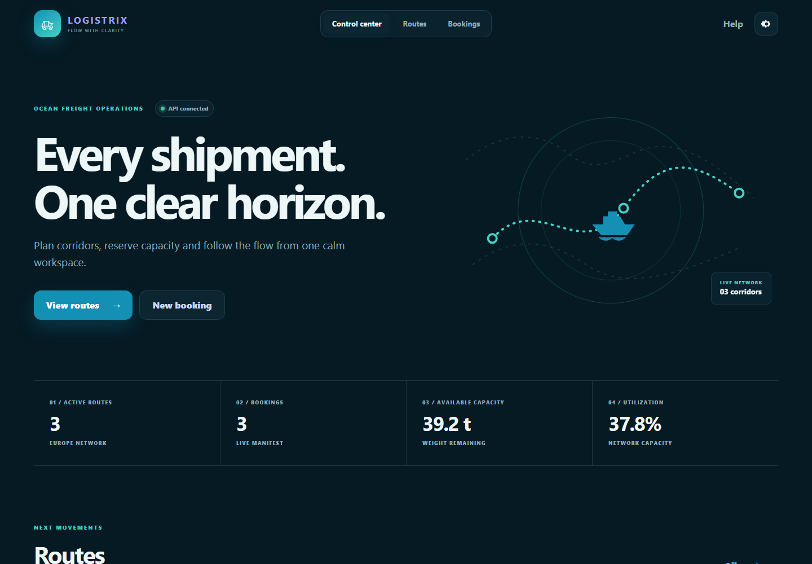
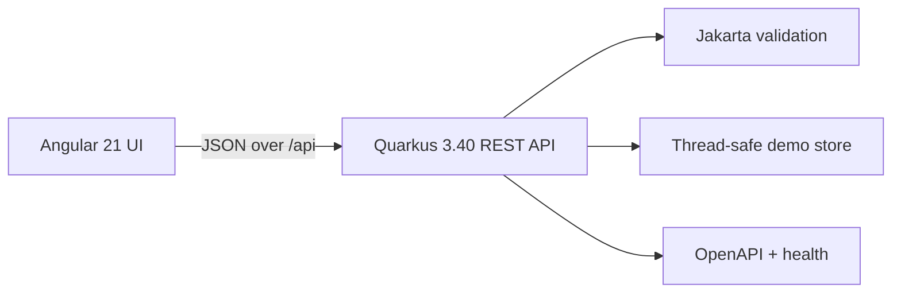

# Logistix — Ocean Control

[](https://github.com/sofoste93/logistix-ui/actions/workflows/ci.yml)
[](https://github.com/sofoste93/logistix-ui/releases/latest)
[](LICENSE)

A compact logistics control center for transport routes, capacity and bookings. Version 2 restores the original university project as a professional, learner-friendly full-stack application with an ocean-blue interface.



## What is on board?

- Live dashboard with route flow, capacity and booking metrics
- Route search and creation with payload and volume limits
- Capacity-aware bookings with server-side validation
- English, German and French interface
- Light, dark and system themes, plus reduced-motion mode
- Built-in help, OpenAPI document, Swagger UI and health endpoint
- Responsive layout for desktop, tablet and smartphone
- Native runtime bundles for Windows, Linux, macOS Intel and Apple silicon

## Install a release

Download the archive for your system from the [latest release](https://github.com/sofoste93/logistix-ui/releases/latest), extract it and start Logistix. The native archives include a Java runtime.

| System | Download | Start |
| --- | --- | --- |
| Windows x64 | `Logistix-Windows-x64.zip` | `Logistix/Logistix.exe` |
| Linux x64 | `Logistix-Linux-x64.tar.gz` | `Logistix/bin/Logistix` |
| macOS Intel | `Logistix-macOS-x64.tar.gz` | `Logistix.app` |
| macOS Apple silicon | `Logistix-macOS-arm64.tar.gz` | `Logistix.app` |

Then open [http://localhost:8080](http://localhost:8080). The first unsigned Windows build may display a Microsoft Defender SmartScreen notice because it does not yet have a commercial code-signing certificate.

The portable `Logistix-2.0.0.jar` is also available for systems with Java 17 or newer:

```bash
java -jar Logistix-2.0.0.jar
```

Verify a download with the matching value in `SHA256SUMS.txt`.

## Use it from a phone

Start Logistix on a computer connected to the same private Wi-Fi network. Find that computer's local IPv4 address, for example `192.168.1.42`, allow Logistix on the private network if the firewall asks, then open this address on the phone:

```text
http://192.168.1.42:8080
```

The computer must remain running. Do not expose port 8080 directly to the public internet; this demonstration release has no user accounts yet.

## Architecture



The production build embeds the Angular files in the Quarkus JAR. One process therefore serves both the UI and API on port 8080. Demo data resets when the application restarts; `LogisticsStore` is the clear replacement point for a database repository.

## Run the source project

Requirements: Node.js 24, npm, Java 17+ and Maven 3.9+.

### Two terminals with live reload

```bash
# Terminal 1 — REST API
mvn -f backend/pom.xml quarkus:dev

# Terminal 2 — Angular UI
npm ci
npm start
```

Open [http://localhost:4200](http://localhost:4200). Angular proxies `/api` and `/q` to Quarkus.

### Build the combined application

```bash
npm ci
npm run build
mvn -f backend/pom.xml package
java -jar backend/target/logistix-api-2.0.0-runner.jar
```

Windows users can set `JAVA_HOME` to Java 17+ and run `run-windows.bat`. Linux and macOS users can run `./run-unix.sh`.

### Docker

```bash
docker compose up --build
```

## REST map

| Method | Path | Purpose |
| --- | --- | --- |
| `GET` | `/api/dashboard` | Aggregated operating metrics |
| `GET` | `/api/routes` | Available transport routes |
| `POST` | `/api/routes` | Create and validate a route |
| `GET` | `/api/bookings` | Current bookings |
| `POST` | `/api/bookings` | Reserve capacity on a route |
| `GET` | `/q/health` | Runtime health |
| `GET` | `/q/swagger-ui` | Interactive API documentation |

Continue with the [learning tutorial](docs/TUTORIAL.md) to follow one booking from the Angular form to the REST resource and store.

## Quality checks

```bash
npm run check
mvn -f backend/pom.xml test
```

CI runs UI tests, API tests on Java 17 and 21, then starts the final combined JAR and checks its UI, dashboard and health endpoint.

## Languages

**FR :** ouvrez *Settings* pour passer l'interface en français. **DE:** Unter *Settings* kann die Oberfläche auf Deutsch umgestellt werden. These preferences are stored only in the browser.

## License

MIT — see [LICENSE](LICENSE).
